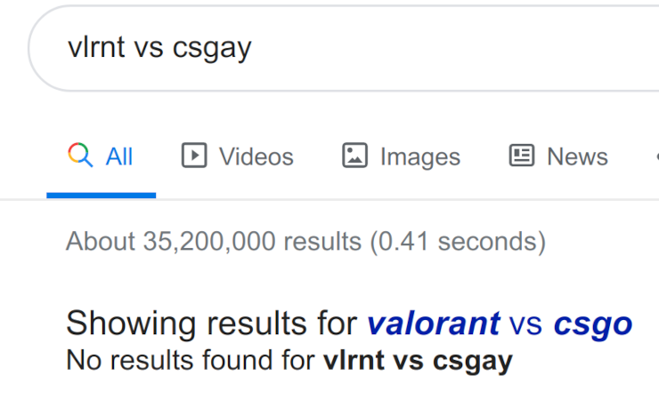
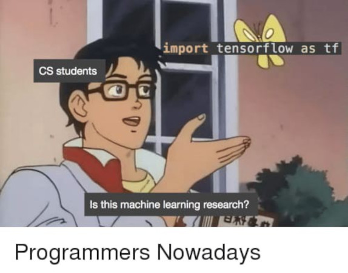
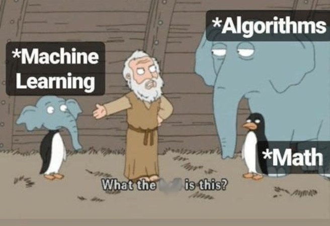

DESCRIPTION
===========

### What is it?

* it's a branch of AI where the machine keeps on improving (learning), w/o us
  modifying any code.

### ML Examples (1/5)

It eventually learns what fat-fingered mistypes mean

### ML Examples (2/5)

It eventually learns your tendencies as a buyer

### ML Examples (3/5)

It eventually learns to recognize your face

### ML Examples (4/5)

A handy assistant that can understand human speech

### ML Examples (5a/5)

AI opponents that can trash human champions

<iframe width="800" height="450" src="https://www.youtube.com/embed/7L2sUGcOgh0" frameborder="0" allow="accelerometer; autoplay; encrypted-media; gyroscope; picture-in-picture" allowfullscreen></iframe>

### ML Examples (5b/5)

AI opponents that can trash human champions

<iframe width="800" height="450" src="https://www.youtube.com/embed/eHipy_j29Xw" frameborder="0" allow="accelerometer; autoplay; encrypted-media; gyroscope; picture-in-picture" allowfullscreen></iframe>

### Learning Approach (1/2)

ggez no-sweat: `import some_ml_lib as lib`

### Learning Approach (2/2)

Tensorflow, Keras, Pytorch will disappear someday

### Math and ML (1/3)

Did you say Math?

### Math and ML (2/3)

It's good to know **why** an ML algorithm works...

### Math and ML (3/3)

...and how to use them properly

#### What ML-friendly programming language? (1/3)

#### What ML-friendly programming language? (2/3)

> Data scientists, machine learning developers and data engineers are turning decisively to the Python programming language, according to a new study.

Source: https://www.datanami.com/2020/02/19/python-dominates-usage-survey-confirms/

#### What ML-friendly programming language? (2/3)

> Python’s growing popularity was fueled by machine learning development. The survey found that Python usage for AI, deep learning and natural language processing projects grew by 9 percent over 2018.

Source: https://www.datanami.com/2020/02/19/python-dominates-usage-survey-confirms/

#### What ML-friendly programming language? (2/3)

> “Python has acquired new relevance amid strong interest in AI and ML,” the usage survey authors noted. “Along with R, Python is one of the most-used languages for data analysis.”

Source: https://www.datanami.com/2020/02/19/python-dominates-usage-survey-confirms/

#### What ML-friendly programming language? (2/3)

> Python’s growing popularity for machine learning development came at the expanse of R, which has been declining since 2017. 

Source: https://www.datanami.com/2020/02/19/python-dominates-usage-survey-confirms/

#### What ML-friendly programming language? (3/3)

* You already know it (SE-1121)
* Popularity, maturity, ecosystem (more resources)
* Top ML libraries are Python-first
  - [Tensorflow](https://github.com/tensorflow/tensorflow) (Google, 148k ⭐)
  - [PyTorch](https://github.com/pytorch/pytorch) (Facebook, 41.4k ⭐)
  - [Keras](https://github.com/keras-team/keras) (49.4k)
  - [scikit-learn](https://github.com/scikit-learn/scikit-learn) (42.1k)
* More general purpose
  - can write backend in Python with popular libraries
    + [Flask](https://github.com/pallets/flask) (51.8k ⭐), 
      <msall style="color: darkgoldenrod">
        first encounter: DSC Cloud Study Jam
      </msall>
    + [Django](https://github.com/django/django) (51.7k ⭐)

COURSE OUTLINE
==============

### What we'll learn? (1/10)

reviewing prerequisite topics (algorithms, Math), and familiarizing ourselves with the Python 
ML ecosystem

### What we'll learn? (2/10)

introduce ML and the two main types of ML algos.  We also explore 2 non-ML AI algos for comparison

### What we'll learn? (3/10)

Your first algo:  make reasonable guesstimates  
(house prices, # of passers for SE-3121, etc.)

### What we'll learn? (4/10)

classify a photo correctly:  is it a cat or dog?  

### What we'll learn? (5/10)

Take inspiration from our nervous system: build a network of artificial neurons.

### What we'll learn? (6/10)

tell when a learning algorithm is doing poorly, "debug" them, improve their performance

### What we'll learn? (7/10)

Learn another classification algo, that uses a wide plane as a separator rather than a
mere line

### What we'll learn? (8/10)

Have the machine learn find patterns and clusters of similar elements from a random, chaotic set 
of data

### What we'll learn? (9/10)

Teach the machine how to spot fishy transactions, like sudden overspending from a customer's
credit card

### What we'll learn? (10/10)

Replicate those creepy (and usually spot-on) recommendations ala Amazon and Netflix

### Pre-requisites

* Direct Pre-req: EMath 2200 - Linear Algebra
  - matrix operations
* Indirect prereqs: EMath 1101 (Calculus I) and EMath 1202 (Eng'g Data Analysis)
  - derivatives
  - minima and maxima
  - probability and statistics
* SE 2221 - Algorithms
  - Big-O Notation
  - Complexity Analysis

### Which courses need SE-3123 as a prerequisite?

* only SE 3221 - Capstone Project I
  - your *Uber for \_\_\_\_\_* MVP idea may need ML
  

