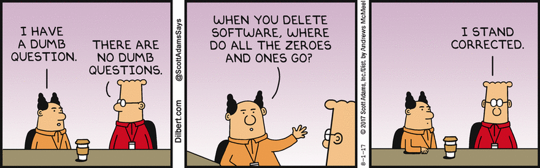
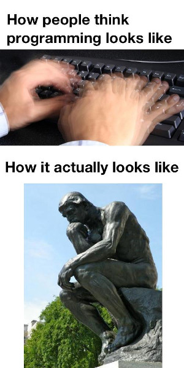
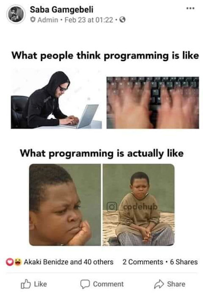
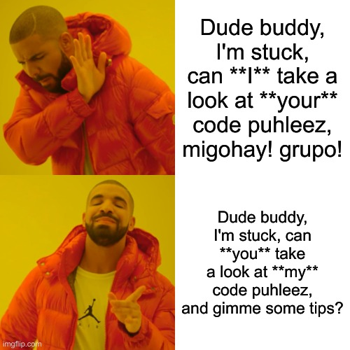

GO THE EXTRA MILE
=================

+ fast learners will have lots of extra time
  - don't be idle and waste time
  - learn beyond what's required

#### Jesus taught us to go the extra mile

ASK QUESTIONS
=============

There are no stupid questions, don't be shy.

ACADEMIC INTEGRITY
==================

**Absolutely no to cheating in my classes**

> Whoever can be trusted with very little can also be trusted with much, and whoever is dishonest with very little will also be dishonest with much.  
\-Luke 16:10

> Whoever walks in integrity walks securely,
> but whoever takes crooked paths will be found out.  
\-Proverbs 10:9

#### Remember coding is thinking, not copying
|  |  |
|----------------------------|-----------------------------|

#### If you don't get caught
* it will still backfire, one day when working, you'll have no one to copy from
  - remember Prov 10:9, you **will** be found out
* only ~8% of PH grads can pass Stacktrek's exam for applicants
  - they graduated but can't pass a **basic** coding exam?
* but there's Google!
  - a bank in our country got hacked, for copying, **without understanding** -- StackOverflow code
    snippets that is neither meant to be complete nor secure, but just illustrates an idea

#### If you're stuck with a problem set for more than 45 minutes

#### If you're stuck with a quiz or exam for more than 45 minutes

Treat *new normal* quizzes and exams as **proctored**