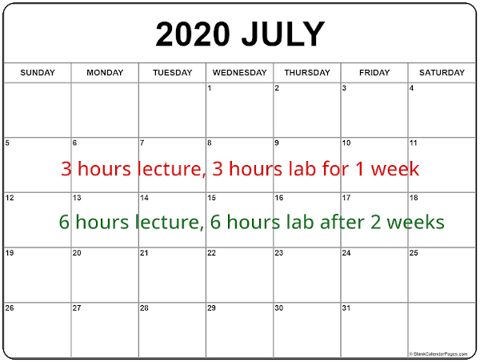
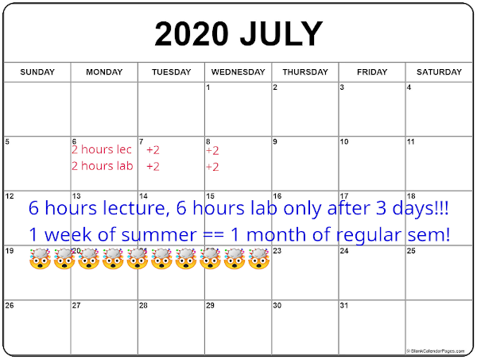
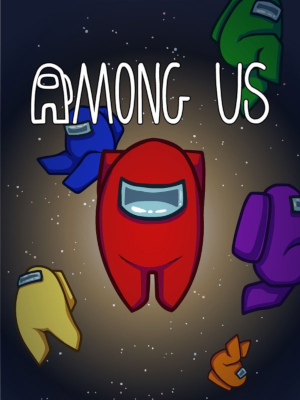
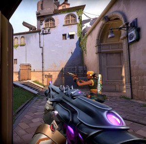

SUBTERMS PACE
=============

#### Just like summer classes

#### ~~Summer Classes~~ Subterms are fast-paced

* SE-3121 is a 3-unit lecture, 3 unit lab course
  - a sem has 18 weeks, so we need 54 + 54 hours of lec/lab
  - to get 54 + 54 hours of lec/lab in a subterm, we need:
    + 2 hours of lec eacy day * 27 days = 54 hours lec **(1:30-3:30 M-F)**
    + 2 hourss of lab each day * 27 days = 54 hours lab **(3:30-5:30 M-F)**
* Pros and Cons:
  + 👍 improved focus: learn only 2-3 subjects at a time
  + 👍 low chances of 8 teachers giving the same 11:59pm on a random Friday
  + 👎 you lose more if you have a _"bad day"_ or worse, "days"
    - maybe your are sleep-deprived and your brain doesn't cooperate
    - get sick for 3 days and you've missed 2 weeks worth of classes

#### Semestral Classes are chill-paced

#### ~~Summer Classes~~ Subterms are fast-paced

### If you think you have time for

  
  
  

    
    
  

Think again...😁
